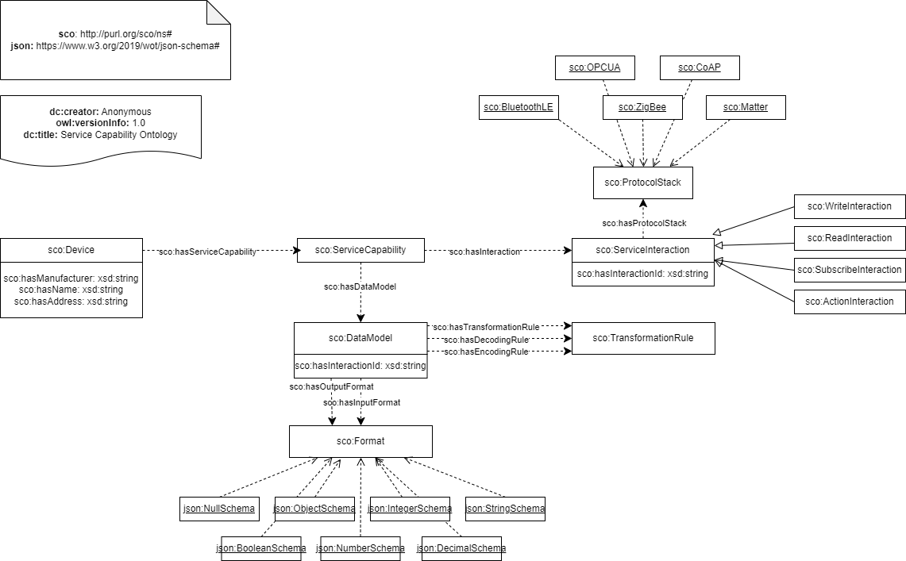
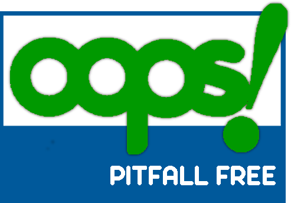

# Service Capability Ontology
This is the documentation of the Service Capability (SCO). SCO is a light-weight, application ontology for the translation of legacy IoT devices to Things of the W3C Web of Things.
SCO contributes to the automatic generation of Thing Descriptions for modeling the key components necessary for a W3C Web of Things Thing Description.

## Structure of the Documentation
The documentation follows the [Linked Open Terms-Framework (LOT)](https://lot.linkeddata.es/). 
LOT is a methodology for developing ontologies and vocabularies. 
It consists of four steps:
- [Ontology Requirements Specification](#ontology-requirement-specification)
- [Ontology Implementation](#ontology-implementation)
- [Ontology Publication](#ontology-publication)
- [Ontology Maintenance](#ontology-maintenance)

## Ontology Requirement Specification
The aim of the requirements specification process is to state why the ontology is being built and to identify and define the requirements the ontology should fulfil.

### Use Case Specification
Activity aiming to provide a vision of potential use of ontology.
* Artefact: List of Usecases
* Result: [Use Cases](./doc/usecases/use-case-specification.md)

### Data Exchange Identification / Knowledge Acquisition
Activity aiming to provide the the necessary documentation about the domain to be modeled (e.g., data sets, regulations, standards, data formats, API identification, database schema, etc.)
* Artefact: Set of domain documents and resources
* Results: [Domain Documents and Resources](./doc/knowledge-acquisition//document-overview.md)

### Purpose, Scope & Requirements Identification
Activity aiming to describe the purpose and scope of the ontology; and to produce a set of functional & non- functional requirements that can be materialized into Competency Questions (CQs), Natural Language Statement or Tabular Information
* Artefacts: Text describing purpose & scope, Set of requirements, Tabular information about concepts, relations & attributes
* Results: [Domain Requirement Table](./doc/ontology-requirements-specification-document/domain-requirement-table.xlsx)

### Ontology Requirements specification document (ORSD) formalization
The ORSD stores all functional and non-functional requirements identified and the information associated with them 
* Result: [Ontology Requirement Specification Document](./doc/ontology-requirements-specification-document/ontology-requirement-specification-document.md) 

## Ontology Implementation
The aim of the ontology implementation process is to build the ontology using a formal language, based on the ontological requirements.
During the Implementation step, the ontology is conceptualized, encoded in a specific language, and evaluated to guarantee syntactic, modelling, and semantic error-freeness. 

### Conceptualization

### Encoding 
The Ontology is encoded in OWL. We provide different serialization of the ontology ([Turtle](./resources/serializations/ontology.ttl), [RDF/XML](./resources/serializations/ontology.owl), [JSON-LD](./resources/serializations/ontology.jsonld), [N-Triples](./resources/serializations/ontology.nt)) 

### Evaluation
We used the [Oops-Validator](https://oeg.fi.upm.es/index.php/en/technologies/292-oops/index.html) to validate the evaluate the correctness. 
The results of the evaluation are:

The usage of the ontology in the SCO implementation further validates its usage.

## Ontology Publication
The aim of the ontology publication process is to provide an online ontology accessible both as a human-readable documentation and a machine-readable file from its URI.

- For the Ontology Publication Process WIDOCO is used.
- The Ontology is available over: http://purl.org/sco/documentation
- The codebase is also provided [here](./service-capability-ontology/).
- Licenses of SCO and other imported ontologies can be found [here](./LICENSE.md) 

- Title: Service Capability Ontology
- Authors: Rene Dorsch and Kiara Ascencion
- License: Attribution-ShareAlike 4.0 International (CC BY-SA 4.0)
- Issued Date: 2023-09-16
- Modified Date: 2024-04-26
- Namespace URI: http://purl.org/sco/ns#
- Version: 1.0
- Version IRI: http://purl.org/sco/ns#
- Prefix: sco

## Ontology Maintenance
The goal of this activity is to update and add new requirements to the ontology that are not identified in the ORSD, to identify and corrects errors or to schedule a new iteration for ontology development.

- To enable reuse of the ontology by other users the repository will be made public.
- Issues will be tracked with the GitHub Issue Tracker to keep the Ontology and supplementary material with the closed issues consistent.

